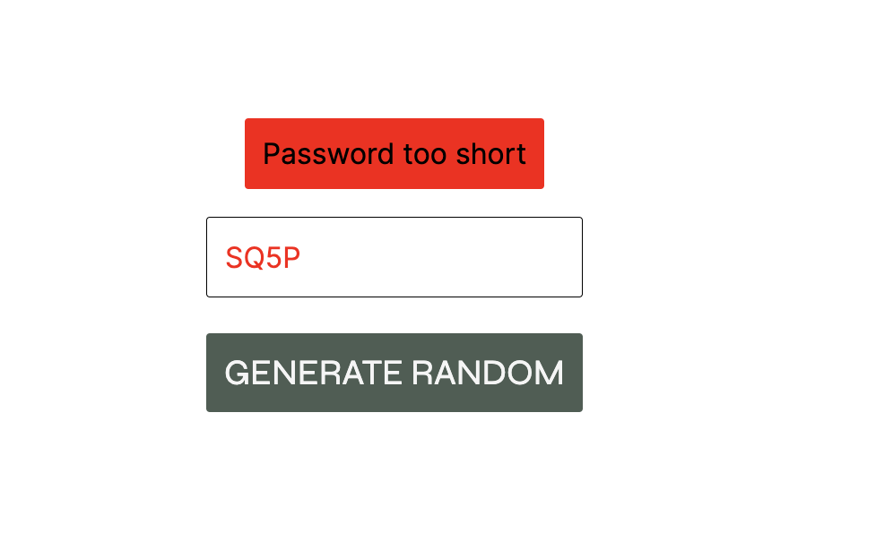

# password-generator

# Password Generator by Fedi

## Overview

This is a simple password generator web application. It is my first real JavaScript project, built as a practice exercise to enhance JavaScript skills. The application allows users to generate random passwords and save them for later use.

## Table of Contents

- [Features](#features)
- [Installation](#installation)
- [Usage](#usage)
- [Contributing](#contributing)
- [License](#license)

## Features



- Generate random passwords with a click of a button.
- Validate generated passwords to ensure they meet certain criteria (e.g., minimum length, inclusion of a number).
- Save generated passwords for future reference.

## Installation

1. Clone the repository to your local machine:

   ```bash
   git clone https://github.com/your-username/your-password-generator.git
   ```

2. Open the project folder:

   ```bash
   cd your-password-generator
   ```

3. Open the `index.html` file in your web browser.

## Usage

1. Open the Password Generator in your web browser.
2. Click the "Generate Random" button to create a new password.
3. The generated password will be displayed, and you'll receive feedback on its validity.
4. Click the "Save Password" button to store the password in the list.

## Contributing

If you'd like to contribute to this project, please follow these steps:

1. Fork the repository on GitHub.
2. Clone your forked repository to your local machine.
3. Create a new branch for your feature or bug fix: `git checkout -b feature-name`.
4. Make your changes and commit them: `git commit -m 'Description of the changes'`.
5. Push your changes to your fork: `git push origin feature-name`.
6. Create a pull request on the original repository.

## License

This project is licensed under the [MIT License](LICENSE).
